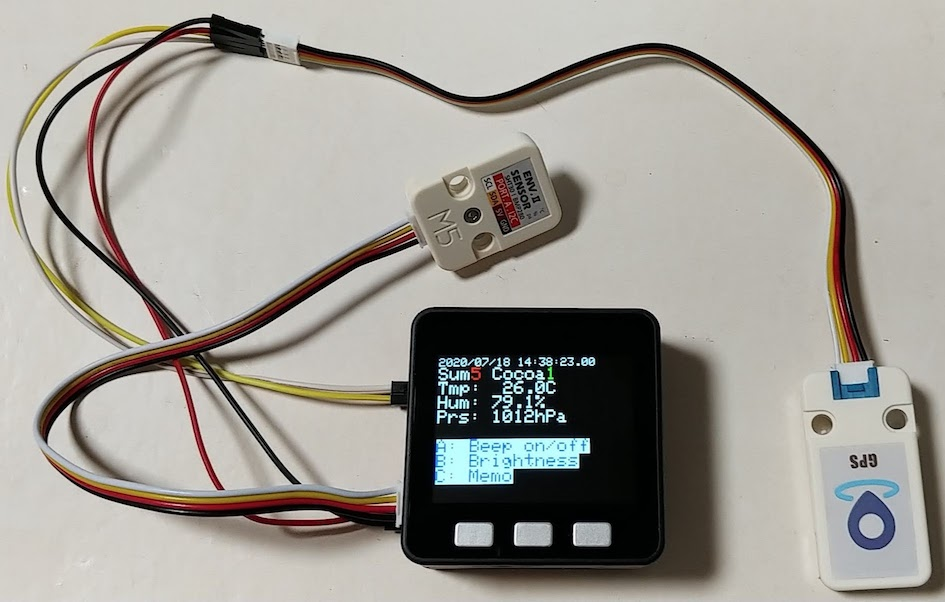
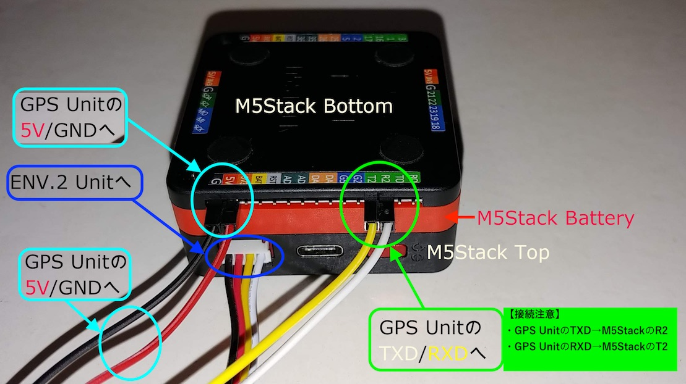

# his.gps.log
a sketch to save logs for M5Stack GPS Unit
and a sketch to upload logs w/ http POST using JSON

## 今回のハード構成

	

<ul>
  <li><a href="https://www.switch-science.com/catalog/3647/">M5Stack Basic</a></li>
  <li><a href="https://www.switch-science.com/catalog/5694/">M5Stack用GPSユニット</a></li>
  <li><a href="https://www.switch-science.com/catalog/6344/">M5Stack用環境センサユニット ver.2（ENV II）</a></li>
  <li><a href="https://www.switch-science.com/catalog/3653/">M5Stack用電池モジュール</a></li>
</ul>

## 各ユニットの接続

    

## 主な機能
    M5Stackの内蔵BLEを使って、厚労省の接触確認アプリCocoaを検出するもの。
    BLE全体で検出した台数と内数としてのCoCoa台数を表示する。
    検出した情報は、microSDにログファイルとして記録する。
    M5Stack Basicに温度湿度気圧センサであるENV.2 UnitをGROVE経由で接続し、
    それらの情報もついでに表示・記録する。
    GPS Unitを接続し、検出した時の位置情報と日時を記録する。

## 付加機能
    ボタンA(左)を押すと、M5Stack-SD-Updaterに遷移する。
    ボタンB(中)を押すと、Cocoa検出時のBeep音をon/offさせる。
    ボタンC(右)を押すと、LCDのサイクリックに変わる。

## 既知のバグ
    GPSからの取得データ値がおかしなことがある。
    具体的には、timeが更新されないことがある。
    シリアル経由での読み込みルーチンの見直しが必要のようだが、後回しにしている(^^;
    
